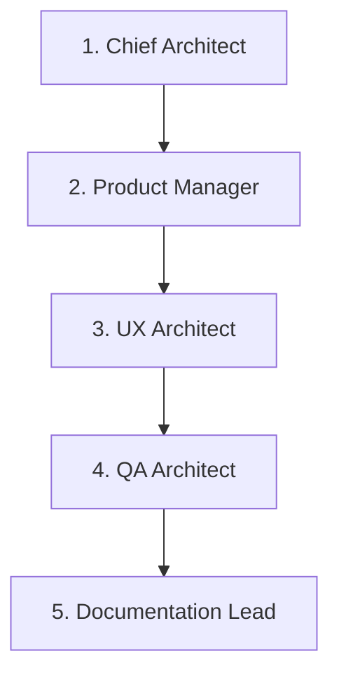

# Sentinel Multi-Agent Collaboration Coordinator

This directory contains the behavioral files for the Sentinel Specialized AI Agent Team. Before starting a development sprint or executing tasks, developers or AI agents can load these system files to adopt the correct review perspective.

---

## The Collaboration Pipeline

Every feature implementation or bug fix is processed through the five-phase review gate specified in **RFC 005 (Specialized Agent Roles)**:

---

## Agent Roster

- **[Chief Architect](file:///home/sanket/Desktop/Sanket/Sentinel/.agents/chief_architect.md):** Verifies C++20 standard compliance, RAII, modular monopolies boundaries, and interface decoupling.
- **[Product Manager](file:///home/sanket/Desktop/Sanket/Sentinel/.agents/product_manager.md):** Enforces object-oriented principles, offline-first constraints, and scope boundaries.
- **[UX Architect](file:///home/sanket/Desktop/Sanket/Sentinel/.agents/ux_architect.md):** Verifies Universal Layout constraints, inspector focus, and density metrics.
- **[Core Engineer](file:///home/sanket/Desktop/Sanket/Sentinel/.agents/core_engineer.md):** Writes and maintains C++ domain, scanning, rules, events, and cache layers.
- **[Frontend Engineer](file:///home/sanket/Desktop/Sanket/Sentinel/.agents/frontend_engineer.md):** Implements React components and QWebEngineView IPC bridges.
- **[Plugin Engineer](file:///home/sanket/Desktop/Sanket/Sentinel/.agents/plugin_engineer.md):** Implements analyzer providers (clang-tidy, Cppcheck) via the SDK.
- **[QA Architect](file:///home/sanket/Desktop/Sanket/Sentinel/.agents/qa_architect.md):** Writes tests, sanitizer checks, and UI automation profiles.
- **[Documentation Lead](file:///home/sanket/Desktop/Sanket/Sentinel/.agents/documentation_lead.md):** Validates Doxygen specs, README standards, and user guides.

---

## Enforcing Agent Rules

When writing code for Sentinel, check your changes against the checklists in each specialized agent's file. Do not merge code that fails any review criteria.
