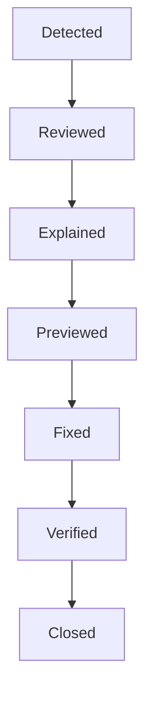

# Sentinel Product Design Specification (SPDS)

# Volume 4 — Analyze Workspace

**Version:** 1.0
**Status:** Approved
**Author:** Head of Product / Lead UX Designer

---

## 1. Vision & Core Philosophy

The **Analyze Workspace** is the heart of Sentinel. It is the workspace where developers spend 70% of their active time.

Today, traditional developer tooling approaches static analysis as a **warning list** (e.g., compile code, get 234 lint messages, scroll through a terminal or a flat table, fix issues). This creates high cognitive friction and developer anxiety.

Sentinel shifts the paradigm from a warning list to a **Decision-Making Workspace**. It operates under one central guiding statement:

> **Help developers understand _why_ something matters before asking them to fix it.**

Within **10 seconds** of landing on the Analyze Workspace, a developer must know:

- What is blocking me?
- What is safe to auto-apply?
- What is risky?
- What changed since my last scan?
- What should I fix first?
- Can I ignore anything?

---

## 2. Layout Grid

The Analyze Workspace is rendered within the universal three-column layout frame:

```text
┌──────────────────────────────────────────────────────────────────────────────┐
│ Global Toolbar                                                               │
├──────────────┬──────────────────────────────────────────────┬────────────────┤
│ Navigation   │ Analyze Workspace Area                       │ Inspector      │
│ Sidebar      │ (Scrollable Center Pane)                     │ Panel          │
│              │                                              │ (Contextual    │
│              │                                              │  Details)      │
│              │                                              │                │
├──────────────┴──────────────────────────────────────────────┴────────────────┤
│ Status Bar / Footer                                                          │
└──────────────────────────────────────────────────────────────────────────────┘
```

- **Navigation Sidebar (Left):** Width: `240px`. Highlighting the `🔎 Analyze` workspace.
- **Analyze Workspace Area (Center):** Fluid width, scrollable, optimized for high readability.
- **Inspector Panel (Right):** Width: `380px`. Contains context-aware details, tabs, and documentation.
- **Status Bar (Bottom):** Height: `28px`.

---

## 3. The 8 Core Sections

The center pane of the Analyze Workspace is organized into exactly **eight sections**, arranged vertically.

### Section 1: Readiness Hero

A large, high-impact banner positioned at the top of the workspace. It functions as Sentinel's visual identity.

```text
─────────────────────────────────────────────────────────────
READY TO COMMIT: ❌ NO
─────────────────────────────────────────────────────────────
Blocking: 2   |   Suggestions: 17   |   Safe Fixes: 29   |   Est. Effort: 8 min
─────────────────────────────────────────────────────────────
[ Continue Working → ]
```

- **Status Display:** Large typography detailing if the project is ready to be checked in.
- **Quick Stats:** Actionable counts of Blocking items (must fix), Suggestions, Safe Fixes (highly confident automations), and Estimated time to clear issues.
- **Primary Action:** `Continue Working →` (Directly opens the most relevant blocking issue).

### Section 2: Today's Priorities

A list of high-priority issues structured as actionable tasks with estimated time tags.

- **Task Card Format:**

  ```text
  Today's Priorities
  ───────────────────────────────────────────────────────────
  1. Memory Leak (Leak in EventBus dispatcher)          2 min
  2. Unused Includes (Redundant header imports)        20 sec
  3. Performance Bottleneck (Pass-by-value in main)     3 min
  4. Naming Convention (Non-conforming variable)       Later
  ```

### Section 3: Issue Categories (Domains)

A grid of five domain-focused cards instead of analyzer names.

- **Domains:**
  1. **Performance**
  2. **Memory**
  3. **Architecture**
  4. **Security**
  5. **Modernization**
- **Interaction:** Clicking any domain card triggers a layout transition:
  `Category` $\rightarrow$ `Sub-category/Leak` $\rightarrow$ `Scoped Issue List` $\rightarrow$ `Focus Inspector`.

### Section 4: Smart Filters

A single-row toggle bar allowing developers to filter issues by workflow status.

```text
[ Blocking ]  [ Safe ]  [ Changed Files ]  [ High Impact ]  [ Quick Wins ]  [ Ignored ]  [ New ]
```

- _Note:_ Severities and analyzer names are relegated to secondary metadata. Workflows are primary.

### Section 5: Issue List

A high-density list of mini-cards. Each card has a minimal, premium presentation:

```text
━━━━━━━━━━━━━━━━━━━━━━━━━━━━━━━━━━━━━━━━━━━━━━━━━━━━━━━━━━━━━
Memory Leak (core/event_bus/EventBus.cpp)
Medium  |  Safe  |  2 min                       [ Preview → ]
━━━━━━━━━━━━━━━━━━━━━━━━━━━━━━━━━━━━━━━━━━━━━━━━━━━━━━━━━━━━━
```

- **Hover Interaction:** Displays quick actions overlay:
  `[ Preview ]` `[ Explain ]` `[ Ignore ]` `[ Bookmark ]` `[ Open IDE ]`.
- **Selection:** Click highlights the card and maps it to the Right Inspector. Double-click enters **Investigation Mode** (Volume 4.5).

### Section 6: Smart Explanation

A progressive disclosure interface inside the issue view or inspector detailing:

- **Why:** The core rationale behind the warning.
- **Impact:** What happens in production or runtime if ignored.
- **Recommended Fix:** Simple explanation of the fix (e.g., Use `std::unique_ptr`).
- **Example:** Before/After code comparison snippet.
- **Preview:** Links to the inline interactive code diff.
- **Analyzer Details:** Collapsed pane for power users containing raw compiler warnings.

### Section 7: Related Issues

A section displaying issues that share the same root cause or file scope:

```text
Memory Leak
  ↳ Related: Allocation Scope
  ↳ Related: Missing Destructor cleanup
  ↳ Related: Raw Pointer Ownership
```

Allows resolving multiple related warnings simultaneously.

### Section 8: Recommended Actions

An actionable list of immediate corrections:

- `[ Apply Safe Fix ]` (Auto-replaces raw pointer with `unique_ptr`)
- `[ Remove Redundant Includes ]`
- `[ Run Formatting Linter ]`

---

## 4. The Inspector Panel

The Right Inspector panel has a tabbed structure to fit all critical details without cluttering:

- **Overview Tab:** Summary of issue, file location, severity level, estimated effort, and confidence rating.
- **Explanation Tab:** Rich markdown text, links, and code example block.
- **History Tab:** Historical commits or scans where this issue appeared or changed.
- **References Tab:** Standard guides (Google C++ Style Guide, MISRA C++, LLVM Coding Standards, Core Rules).
- **Diff Tab:** Interactive code diff editor allowing inline modification review.
- **Documentation Tab:** In-depth documentation of the static analyzer rule.
- **Raw Analyzer Tab:** Collapsed view containing raw compiler or linter diagnostic outputs.

---

## 5. Grouping Rules

Sentinel groups issues to match the developer's execution sequence rather than analyzer categories:

1. **Quick Wins:** High confidence, short estimated effort.
2. **Blocking:** Strict blockers that prevent safe commit.
3. **Architecture:** Layering violations, cyclic dependencies.
4. **Memory:** Resource leaks, dangling pointers.
5. **Performance:** Costly copies, loop inefficiencies.
6. **Security:** Vulnerabilities, buffer overflows.
7. **Everything Else:** Style conformances, naming rules.

---

## 6. Keyboard Shortcuts & Context Menus

### Keyboard Bindings

- `J` $\rightarrow$ Select next issue in the queue.
- `K` $\rightarrow$ Select previous issue in the queue.
- `E` $\rightarrow$ Focus "Explain" tab in Inspector / Enter Investigation Mode.
- `P` $\rightarrow$ Preview the recommended fix in Diff.
- `A` $\rightarrow$ Apply the recommended fix immediately.
- `I` $\rightarrow$ Trigger the Ignore dialogue.

### Context Menu

Right-clicking any issue card or diagnostic line triggers a contextual list:

- `Preview Fix`
- `Apply Fix`
- `Explain Issue`
- `Open in External IDE`
- `Bookmark Issue`
- `Ignore Rule`
- `Copy Link to Issue`
- `Share Context`

---

## 7. Workflow States

### The Analyze Timeline

Every issue in Sentinel tracks an incremental lifecycle:



This lifecycle gives both managers and developers clear, granular progress metrics beyond "Open" or "Closed".

### Ignored Issues State

To ignore an issue, a developer must select a reason:

1. **False Positive:** The analyzer misidentified the issue.
2. **Won't Fix:** Intentional code design choice.
3. **Legacy:** Part of historical code that cannot be altered.
4. **Accepted Risk:** Low risk, high modification cost.

---

## 8. Dynamic UI States

### Empty State

Rendered when all checks pass:

```text
Excellent.
No issues found.
Project is ready to commit.
```

Includes positive, clean visual styling.

### Loading State

Displays incremental validation instead of generic infinite loading spinners:

```text
Analyzing Memory ....... ✓
Analyzing Performance .. ✓
Analyzing Architecture . [Scanning...]
```

Makes the system feel responsive and alive.
