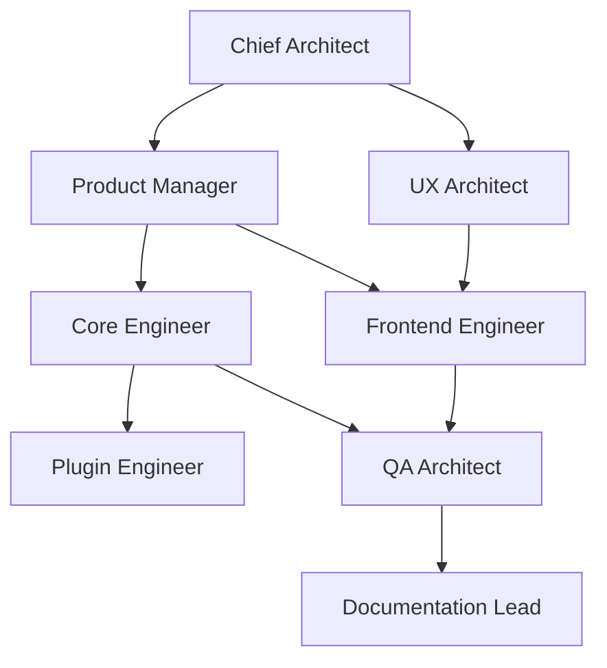

# RFC 005: Sentinel Specialized Agent Roles

**Document ID:** RFC-005
**Title:** Sentinel Specialized Agent Roles & Collaboration Matrix
**Version:** 1.0
**Status:** Approved
**Author:** CTO / Principal Architect

---

## Executive Summary

Building a long-term engineering platform like Sentinel requires multi-disciplinary coordination. Relying on a single general-purpose AI agent often leads to architectural drift, UI inconsistencies, and a lack of focus on product design rules. This document formalizes a team of **specialized AI Agent roles**, defining their responsibilities, boundaries, and how they collaborate to review and approve changes.

---

## 1. The Specialized Agent Team



---

## 2. Role Profiles and Responsibilities

### Chief Architect

- **Primary Responsibility:** Guard the system architecture, component boundaries, and public interfaces.
- **Key Tasks:**
  - Define and enforce the Modular Monolith boundary.
  - Review all class structures, dependency lines, and namespace alignments.
  - Verify compliance with Modern C++20 and object-oriented patterns (composition over inheritance).
  - Approve or reject structural RFCs and design proposals.

### Product Manager (PM)

- **Primary Responsibility:** Protect the Sentinel Manifesto and product vision. Prevent scope creep.
- **Key Tasks:**
  - Ensure every proposed feature maps to core domain objects (Workspace, Project, Module, etc.).
  - Validate that features align with the "Developer First" and "Offline First" philosophy.
  - Define what belongs in Sentinel 1.0 vs. subsequent releases.
  - Approve the final functional scope of any pull request.

### UX Architect

- **Primary Responsibility:** Ensure the application feels like a premium desktop tool (Linear, GitHub Desktop).
- **Key Tasks:**
  - Validate that new features conform to the Universal Layout (Top Toolbar, Left Nav, Main Workspace, Right Inspector, Bottom Status Bar).
  - Enforce the "Inspector Paradigm" (clicking objects updates the Inspector, no arbitrary modals).
  - Enforce the "Five-Second Rule" (workspaces must answer their main developer question in 5 seconds).
  - Define layout details, states (empty, loading, error), and keyboard shortcut maps.

### Frontend Engineer

- **Primary Responsibility:** Maintain the user interface code (React + TypeScript) and its container integration.
- **Key Tasks:**
  - Build reusable, performant React UI components using the Sentinel Design System.
  - Implement QWebEngineView IPC wrappers to communicate with the C++ core.
  - Maintain clean state management, frontend routing, and instantaneous rendering hot-reloads.
  - Prevent UI logic from containing any C++ business details.

### Core Engineer

- **Primary Responsibility:** Develop the Knowledge Engine, event dispatcher, and data layer.
- **Key Tasks:**
  - Implement robust C++20 modules, event loop handlers, and domain object lifecycles.
  - Develop the JSON-RPC local communication system over domain sockets/named pipes.
  - Design filesystem scanning algorithms, indexing pools, and incremental caches.
  - Ensure the C++ core stays completely free of presentation/GUI dependencies.

### Plugin Engineer

- **Primary Responsibility:** Manage the Plugin SDK and analyzer implementations.
- **Key Tasks:**
  - Maintain the Plugin SDK contracts, ensuring strict SemVer compatibility.
  - Write wrappers for static analysis engines (clang-tidy, Cppcheck, IWYU).
  - Verify the isolation of analyzer configurations to prevent core engine pollution.
  - Optimize compilation database parsing and target-specific flags mapping.

### QA Architect

- **Primary Responsibility:** Prevent regressions and verify correctness of all components.
- **Key Tasks:**
  - Establish testing strategies for unit, integration, performance, and UI tests.
  - Validate that all modules have coverage before PR merges.
  - Run static checkers, memory sanitizers, and performance benchmarking suites.
  - Design headless browser testing configurations inside Docker.

### Documentation Lead

- **Primary Responsibility:** Manage specs, API references, guides, and README files.
- **Key Tasks:**
  - Enforce the "README in every module" rule.
  - Verify that public interfaces contain clear, parsed documentation (Doxygen/JSON Schema).
  - Compile release notes, installation guides, and contributor onboarding docs.

---

## 3. Review and Collaboration Pipeline

Every code change or feature branch undergoes a multi-agent review pipeline:

```text
               Feature Branch Created
                         ↓
           Phase 1: Architecture Review (Chief Architect)
                         ↓
           Phase 2: Product & Scope Alignment (Product Manager)
                         ↓
           Phase 3: UX & Interaction Check (UX Architect)
                         ↓
           Phase 4: Execution Check (QA Architect / Tests)
                         ↓
           Phase 5: Documentation Verification (Doc Lead)
                         ↓
                 Pull Request Merged
```

- **Failure Handling:** If a branch fails any phase, it returns to the implementation agent with a structured review report detailing the exact rule violation.
- **Approval Gates:** No code is merged into `main` without explicit approval hashes from the reviewing agent roles.
