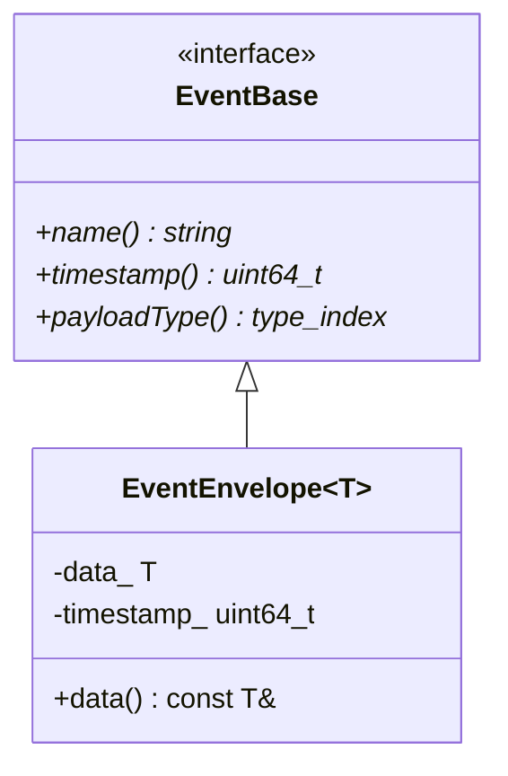
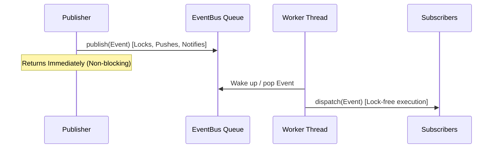

# RFC 008: In-Process Event Loop & Event Bus Specification

**Document ID:** RFC-008
**Title:** In-Process Event Loop & Event Bus Specification
**Version:** 1.0
**Status:** Under Review (Pending Approval Gate)
**Author:** Antigravity (Founding Staff Software Engineer)

---

## 1. Executive Summary & Context

To support a decoupled, highly responsive, and modular architecture, Sentinel avoids compile-time dependencies or synchronous calls between distinct subsystems. In accordance with **RFC-006 (Modular Monolith)**, the core engine relies on an **in-process Event Bus** for decoupled, asynchronous communication.

This specification defines:

1. A type-safe Event envelope structure.
2. An asynchronous Event Bus dispatcher with queue-based processing.
3. Definitions for key lifecycle events: `ScanStarted`, `ScanCompleted`, and `IssueFound`.
4. Subscription registry, reentrancy handling, and concurrency safety.
5. Verification/testing strategy inside the Docker container environment.

---

## 2. Detailed Technical Design

### A. Directory Structure

The files will be structured inside the `core` bounded context:

```text
core/
└── event_bus/
    ├── Event.h       # Event envelope, interfaces, and concrete event types
    ├── EventBus.h    # Subscriber mechanisms and EventBus interface
    └── EventBus.cpp  # Queue execution thread and dispatcher implementation
```

### B. Type-Safe Event Envelope

Sentinel events are represented by lightweight, aggregate structures containing event-specific payloads. We define an abstract type-erased base `EventBase` and a templated class `EventEnvelope<T>` to wrap concrete events type-safely.

#### Type Hierarchy



```cpp
// core/event_bus/Event.h
#pragma once

#include <string>
#include <cstdint>
#include <typeindex>
#include "sentinel/TypedId.h"
#include "sentinel/Quality.h"

namespace sentinel {

class EventBase {
public:
    virtual ~EventBase() = default;
    virtual std::string name() const = 0;
    virtual uint64_t timestamp() const = 0;
    virtual std::type_index payloadType() const = 0;
};

template <typename T>
class EventEnvelope : public EventBase {
public:
    EventEnvelope(T data, uint64_t timestamp)
        : data_(std::move(data)), timestamp_(timestamp) {}

    std::string name() const override { return T::eventName(); }
    uint64_t timestamp() const override { return timestamp_; }
    std::type_index payloadType() const override { return typeid(T); }

    const T& data() const { return data_; }

private:
    T data_;
    uint64_t timestamp_;
};

} // namespace sentinel
```

### C. Concrete Event Types

We define three key events mapping to the product roadmap:

1. **`ScanStarted`**: Dispatched when a workspace analyzer scan begins.
2. **`IssueFound`**: Dispatched incrementally when an analyzer reports a code quality issue.
3. **`ScanCompleted`**: Dispatched when all workspace scanners finish.

```cpp
// core/event_bus/Event.h (continued)

struct ScanStarted {
    ScanId scanId;
    ProjectId projectId;
    uint64_t timestamp;

    static std::string eventName() { return "ScanStarted"; }
};

struct IssueFound {
    ScanId scanId;
    ProjectId projectId;
    Issue issue;
    uint64_t timestamp;

    static std::string eventName() { return "IssueFound"; }
};

struct ScanCompleted {
    ScanId scanId;
    ProjectId projectId;
    uint64_t timestamp;
    int totalIssuesFound;
    bool success;

    static std::string eventName() { return "ScanCompleted"; }
};
```

### D. Subscription Registry & Dispatcher

Subscribers register callback functions for specific types. The registry translates `std::function<void(const T&)>` to type-erased callbacks using polymorphism.

```cpp
// Subscriber Type Erasure
class ISubscriber {
public:
    virtual ~ISubscriber() = default;
    virtual void dispatch(const EventBase& event) = 0;
};

template <typename EventType>
class ConcreteSubscriber : public ISubscriber {
public:
    explicit ConcreteSubscriber(std::function<void(const EventType&)> callback)
        : callback_(std::move(callback)) {}

    void dispatch(const EventBase& event) override {
        if (auto envelope = dynamic_cast<const EventEnvelope<EventType>*>(&event)) {
            callback_(envelope->data());
        }
    }

private:
    std::function<void(const EventType&)> callback_;
};
```

---

## 3. Asynchronous Event Loop & Concurrency Model

### A. Queue-Based Worker Thread

To preserve **strict order correctness** (FIFO) while maintaining non-blocking publishers, the `EventBus` manages a queue of pending events and processes them on a dedicated background thread.

- **`std::jthread`**: Spawns a cooperatively cancellable worker.
- **`std::condition_variable_any`**: Coordinates sleeping and wakeups, integrated directly with the `std::stop_token`.
- **`std::shared_mutex`**: Protects the registry of subscribers to enable concurrent dispatch reads, whilst allowing exclusive write access for `subscribe`/`unsubscribe` operations.



### B. Handling Callback Reentrancy

A major risk in event bus architectures is a subscriber modifying subscriptions (subscribing or unsubscribing) from within a callback, causing deadlocks if the registry mutex is held.

- **Resolution**: During dispatch, the `EventBus` copies the list of subscribers matching the event type, releases the shared registry lock, and then executes the callbacks.

---

## 4. Tradeoffs & Architectural Alternatives

| Design Choice                | Tradeoffs / Alternatives                                                                                                                                          | Rationale                                                                                                                          |
| :--------------------------- | :---------------------------------------------------------------------------------------------------------------------------------------------------------------- | :--------------------------------------------------------------------------------------------------------------------------------- |
| **Single Thread Dispatcher** | **Con:** Lower raw throughput than thread pools.<br>**Pro:** Guarantees strict event ordering (ScanStarted $\rightarrow$ IssueFound $\rightarrow$ ScanCompleted). | Crucial for client UI state machine consistency; jumbled events create bad UX.                                                     |
| **Polymorphic Envelopes**    | **Con:** Dynamic casts and allocations.<br>**Pro:** Type-safe, simple registry interface without complex template metaprogramming.                                | The system processes thousands, not millions, of events per second. Safety and developer readability outweigh microsecond savings. |
| **Callback Copying**         | **Con:** Small vector allocations on dispatch.<br>**Pro:** Prevents reentrant deadlocks when callbacks modify subscriptions.                                      | Prevents silent hanging bugs that are notoriously difficult to debug in concurrent systems.                                        |

---

## 5. Extension Points

1. **Synchronous Publish Support**: Added a `publishSync` method bypasses the queue and runs callbacks immediately on the publisher's thread (useful for synchronous tests and direct critical errors).
2. **Event Filter / Interceptor Middleware**: Standard base class allows logging, auditing, or metric accumulation before dispatch.
3. **Multi-subscriber Thread Pools**: Can be introduced later if specific slow subscribers need offloading, by defining an asynchronous subscriber decorator.

---

## 6. Implementation Checklist & Verification Plan

### Steps

1. Write `core/event_bus/Event.h`.
2. Write `core/event_bus/EventBus.h` and `core/event_bus/EventBus.cpp`.
3. Create a unit test `tests/unit/test_event_bus.cpp` to verify:
   - Synchronous and asynchronous dispatching.
   - Concurrency safety (publishing from multiple threads).
   - Order correctness (FIFO).
   - Reentrant subscribe/unsubscribe within callbacks.
4. Run tests and pre-commit checks in Docker environment.
