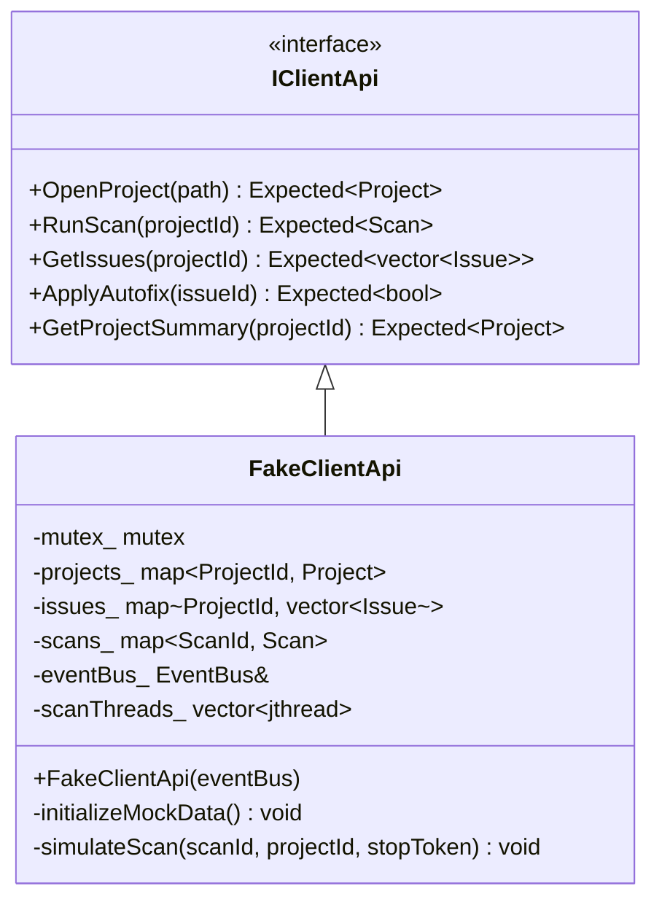
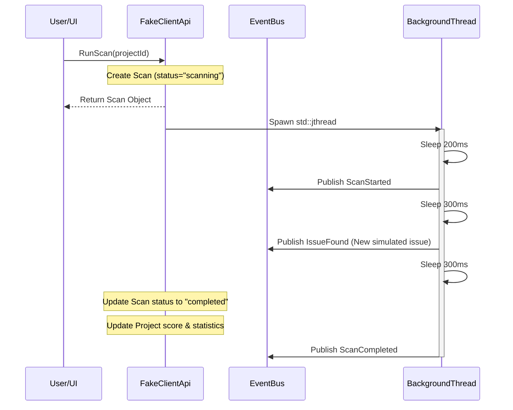

# RFC-009: Fake Data Layer (Mock Service Implementation)

## 1. Context & Purpose

The Sentinel core engine exposes its capabilities through the `IClientApi` interface, which is routed over JSON-RPC by `JsonRpcHandler`. During early UI development (Phase 5 & 6) and before the real compiler diagnostic parsing (Phase 9) or database persistence (Phase 7) are fully integrated, we need a high-fidelity **Fake Data Layer**.

This document proposes the architecture, mock data schemas, and concurrency safety strategy for the mock service implementation (`FakeClientApi`).

---

## 2. Proposed Architecture

`FakeClientApi` will implement `IClientApi` and hold an in-memory thread-safe state store.

### Key Components

1. **In-Memory Store:** Maps and vectors protected by a single `std::mutex` to ensure thread-safe read/write operations from multiple threads (e.g. IPC connection threads and background scanner threads).
2. **Event Bus Integration:** A reference to the in-process `EventBus` to publish scan progress, issue discovery, and scan lifecycle events.
3. **Background Scanning Simulation:** Utilizes `std::jthread` to run asynchronous scan loops. Using `std::jthread` ensures clean thread join on destruction and supports cooperative cancellation via `std::stop_token`.

---

## 3. Data Schema & Mock Datasets

We pre-populate the store with two default projects to simulate standard engineering workspace profiles:

### 3.1. Project 1: Sentinel Core (C++)

- **Path:** `/workspace/sentinel`
- **Language:** `C++`
- **Pre-populated Issues:**
  1. **SQL Injection Risk:** A critical security warning on string concatenation inside SQL statements.
     - **Autofix Available:** Yes (replacing the raw query with parameterized bindings).
  2. **Unused Local Variable:** A low severity style warning.
     - **Autofix Available:** Yes (deleting the unused declaration).

### 3.2. Project 2: SG Dashboard (TypeScript)

- **Path:** `/workspace/sg-dashboard`
- **Language:** `TypeScript`
- **Pre-populated Issues:**
  1. **Console Log Warning:** An info severity style warning.
     - **Autofix Available:** Yes (deleting `console.log`).

---

## 4. Scan Loop Simulation

When `RunScan(projectId)` is called, the following execution sequence occurs in a background thread:

### Scan Progress Events

- **ScanStarted**: Signals the UI to display a loading or progress indicator.
- **IssueFound**: Simulates streaming analyzer findings. A new diagnostic (e.g. `"Unused Header Include"`) is dynamically added to the project's issue list during the scan and published.
- **ScanCompleted**: Signals the end of the analysis, prompting the UI to refresh project scores and the issues table.

---

## 5. Tradeoffs & Decisions

### Tradeoff 1: In-Memory Mock Store vs. File-based SQLite Database

- **In-Memory Store (Chosen):** Very fast to implement, has zero dependencies, and doesn't write binaries to the workspace (compliant with SQLite rules for early phases).
- **SQLite Database:** Better persistence but adds complexity and dependency on schema migrations before rule packs are fully defined.

### Tradeoff 2: Thread Spawning per Scan vs. Fixed Worker Pool

- **Thread Spawning per Scan (Chosen):** Simple, uses modern C++20 `std::jthread` to automate resource management and joining. Safe for low-frequency test runs.
- **Fixed Worker Pool:** More robust for high concurrency but introduces extra thread-pool classes and complexity that are out of scope for a fake data layer.

---

## 6. Extension Points

1. **Error Injection:** Allows simulating network/scanning errors by passing specific paths or configurations to trigger scan failures (e.g. `ScanCompleted` with `success=false`).
2. **Speed Modification:** The sleep durations in the background thread can be configured to test responsive UI gauges and loading animations.

---

## 7. Verification Plan

We will add a dedicated unit test suite: `tests/unit/test_fake_data.cpp`. It will verify:

1. Retrieval of pre-populated projects, summaries, and issues.
2. Successful triggering of scans and checking of transition states.
3. Verification of `EventBus` subscriptions receiving `ScanStarted`, `IssueFound`, and `ScanCompleted` events in FIFO order.
4. Applying autofixes and validating state transitions from `Open` to `Resolved`.
