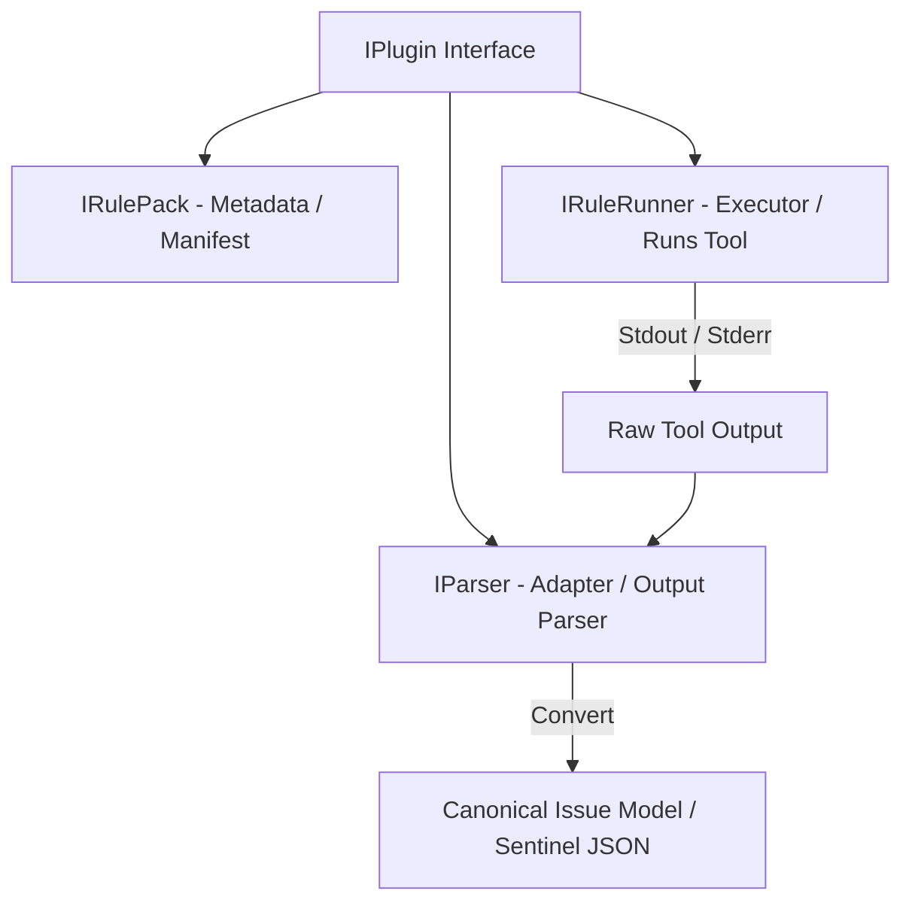

# RFC 010: Sentinel V2 Architecture Alignment & Execution Runtimes

**Document ID:** RFC-010
**Title:** Sentinel V2 Architecture Alignment & Execution Runtimes
**Version:** 1.0
**Status:** Proposed (Awaiting Design Gate Approval)
**Author:** Antigravity AI (Founding Staff Engineer)

---

## 1. Executive Summary & V2 Vision

Following the **Sentinel V2 Engineering Constitution**, Sentinel is clarified as an **Offline First Rule Orchestration Platform**. Sentinel does not understand tool output or execute language-specific interpreters directly. Instead, it schedules runtimes, runs self-contained Rule Packs, and normalizes findings into the **Canonical Sentinel JSON** format.

This RFC outlines:

1. How the existing C++ codebase maps to the V2 Constitution.
2. The runtime execution model (moving from dynamic library plugins `.so`/`.dll` to isolated Native Process/Docker runtimes).
3. The implementation design for **Phase 9: Real LLVM Compiler Integration** (handling `compile_commands.json` and executing live `clang-tidy` / `cppcheck` runs).

---

## 2. Current Codebase Alignment Analysis

The current C++ Core Knowledge Engine maps cleanly to the V2 principles, specifically around the separation of execution and parsing.



### Existing Design Contracts

Our public interfaces in `sdk/include/sentinel` already implement the decoupled split recommended in the V2 Constitution:

- **`IRulePack` (`Metadata`):** Defines rule identifiers, versions, names, and supported rules (equivalent to the manifest validation).
- **`IRuleRunner` (`Executor`):** Runs static analysis and outputs a raw string of results.
- **`IParser` (`Adapter`):** Takes raw analyzer output and translates it into a vector of standardized `Issue` objects.

### File and Module Structure

- **Core Namespace:** Located in `core/`, divided into clear single-responsibility domains (`analyzer`, `event_bus`, `fake_data`, `ipc`, `storage`), adhering to the "no helper/utils directories" hygiene rule.
- **UI & Presentation:** The React-based frontend in `ui/` communicates strictly with the backend via the `JsonRpcHandler` bridge, keeping business logic on the C++ side.

---

## 3. Runtime Architecture & Out-of-Process Execution

The V2 constitution emphasizes that **Sentinel executes runtimes (Native Process, Docker, WASM), not language tools**.

Currently, our plugin loader (`PluginLoader.cpp`) links `.so` shared libraries in-process. To align with V2, we specify how rule executors transition to running isolated child processes.

### Proposed Out-of-Process Execution Architecture

```text
  Rule Engine Core (C++)
          │
          ├── [Option A: Native Process] ──► std::process (fork/exec) ──► bin/clang-tidy
          │
          └── [Option B: Docker Sandbox] ──► docker run --rm -v ...    ──► container/clang-tidy
```

### The `ProcessRunner` Engine Service

Instead of using dynamic libraries for every tool, the core engine introduces a common runtime utility that spawns commands with sandboxing limits.

```cpp
namespace sentinel {

struct ExecutionPermissions {
    bool readFilesystem = true;
    bool writeFilesystem = false;
    bool allowNetwork = false;
    uint32_t timeoutSeconds = 60;
};

class ProcessRunner {
public:
    static Expected<std::string, Error> RunNative(
        const std::string& command,
        const std::vector<std::string>& args,
        const ExecutionPermissions& permissions);

    static Expected<std::string, Error> RunDocker(
        const std::string& image,
        const std::string& command,
        const std::vector<std::string>& args,
        const std::string& mountPath);
};

} // namespace sentinel
```

### Migration Path for Existing Plugins

1. **Clang-Tidy / Cppcheck:** Instead of mockup loops inside the shared library, the `IRuleRunner::Run` implementation will construct a command line call invoking the local system's `clang-tidy` or `cppcheck` via `ProcessRunner::RunNative` (or running in the `llvm` / `devcontainer` docker sandbox).
2. **Adapters:** The `IParser` remains unchanged, consuming the raw CLI string output of these tools and translating them into standard issues.

---

## 4. Phase 9: Real LLVM Compiler Integration

To implement the first real tool integration, we must resolve compile flags using a CMake compilation database (`compile_commands.json`).

### Compilation Database Parser

We will introduce `CompileCommandsParser` in a new `core/compiler/` module:

```cpp
namespace sentinel {

struct CompileCommand {
    std::string directory;
    std::string file;
    std::string command;
    std::vector<std::string> arguments;
};

class CompileCommandsParser {
public:
    static Expected<std::vector<CompileCommand>, Error> Parse(const std::string& filePath);
};

} // namespace sentinel
```

### Live Scanning Execution Flow

1. **Open Repository:** User opens project containing `.sentinel/sentinel.yaml` and `compile_commands.json`.
2. **Execution Plan:** Filter changed files and find matching compiler arguments inside `compile_commands.json`.
3. **Execution:** Run `clang-tidy` passing the corresponding compile flags (e.g. `clang-tidy -p=<build-dir> <files>`).
4. **Parsing:** Feed the standard error/diagnostic stream into `ClangTidyParser` to populate the SQLite database.
5. **UI Update:** Publish `ScanCompleted` to trigger quality score updates and display results in the problems panel.

---

## 5. Design Tradeoffs

| Tradeoff Aspect           | Option A: In-Process Shared Libraries (`.so`)                                               | Option B: Out-of-Process Runtimes (Process/Docker)                                                    |
| :------------------------ | :------------------------------------------------------------------------------------------ | :---------------------------------------------------------------------------------------------------- |
| **Crash Safety**          | **Poor.** A crash or memory leak in a plugin crashes the entire Sentinel application.       | **Excellent.** Spawning child processes isolates crashes, resource leaks, and timeouts.               |
| **Sandboxing & Security** | **None.** Plugins have full read/write/network access of the parent process.                | **High.** Permissions, timeouts, and network constraints can be enforced on container/process levels. |
| **Performance Overhead**  | **Low.** Direct C++ function calls with zero process-switching overhead.                    | **Medium.** Process spawn times (10–50ms) and virtualization overhead for Docker.                     |
| **Portability**           | **Difficult.** Requires recompiling `.so`/`.dll` for every host OS and target architecture. | **Easy.** Distributes platform-specific binaries or utilizes cross-platform Docker images.            |

> [!TIP]
> Given Sentinel is an _offline-first tool runner_, **Option B (Out-of-Process Runtimes)** is the superior path for stability, security, and multi-language support.

---

## 6. Extension Points

1. **WASM Sandboxing:** A future WebAssembly runtime execution service can load pre-compiled `.wasm` rule packs directly within the C++ core process using `wasmtime` or `wasmer`, providing native speed with total process isolation.
2. **Remote Agent Runners:** If the workspace is on a remote server (e.g., SSH dev containers), the `ProcessRunner` can route execution over SSH, keeping the GUI local.

---

## 7. Approval Request & Next Steps

We request architectural feedback and approval from the user on:

- Transitioning rule execution from dynamic libraries (`.so`) to child processes using `ProcessRunner`.
- The design of the `compile_commands.json` parser.

Upon approval, we will proceed to:

1. Implement the `CompileCommandsParser` inside `core/compiler/`.
2. Update the unit tests to pass cleanly without database lockups (by using isolated temp database paths or in-memory contexts for test assertions).
